# 🧪 Laboratorio 4 – IAM Avanzado con Roles y Políticas por Grupo

## 🎯 Objetivo del laboratorio
Aplicar el **principio de mínimo privilegio** en AWS utilizando:
- Grupos de IAM
- Políticas personalizadas
- Asignación de roles mediante herencia grupal
- Simulación de acceso con usuarios restringidos

## 🛠 Herramientas usadas
- AWS IAM
- AWS CLI
- AWS STS
- Perfiles de usuario configurados en `~/.aws/credentials`

---

## 🧭 Pasos realizados

### 1. Crear carpeta de trabajo
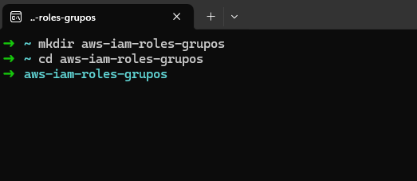

### 2. Crear usuarios IAM
```bash
aws iam create-user --user-name usuario-analista
aws iam create-user --user-name usuario-dev
```
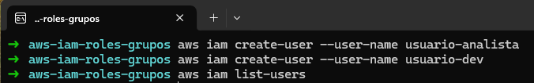

### 3. Verificar usuarios creados
```bash
aws iam list-users
```
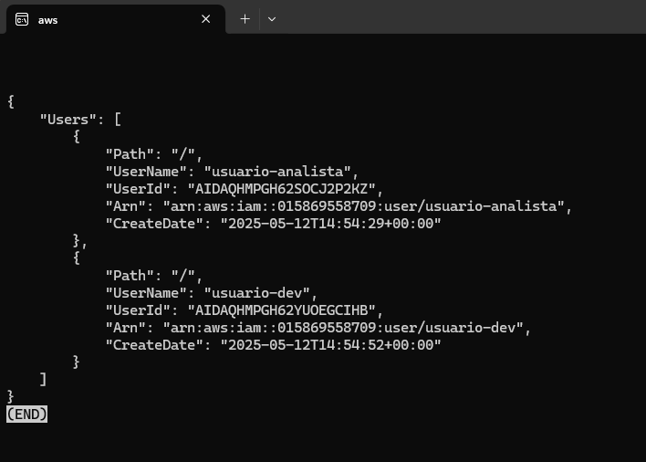

### 4. Crear políticas personalizadas
- `PoliticaAnalistas` con permisos sobre S3 y CloudTrail
- `PoliticaDevs` con permisos para describir instancias EC2

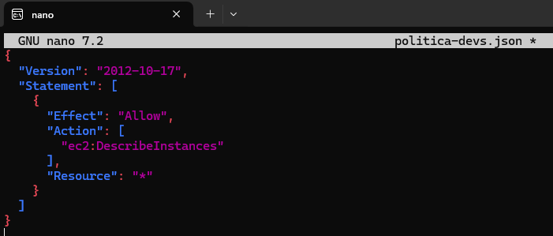
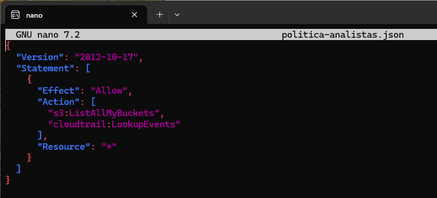

### 5. Crear grupos IAM
```bash
aws iam create-group --group-name grupo-analistas,
aws iam create-group --group-name grupo-devs
```
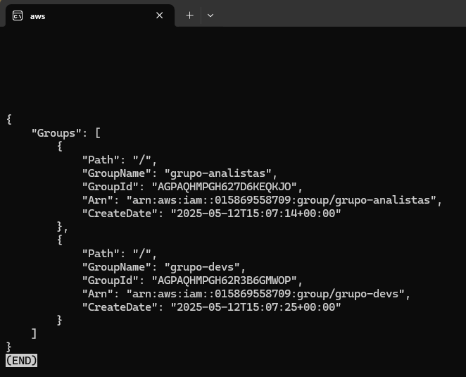

### 6. Crear políticas en AWS
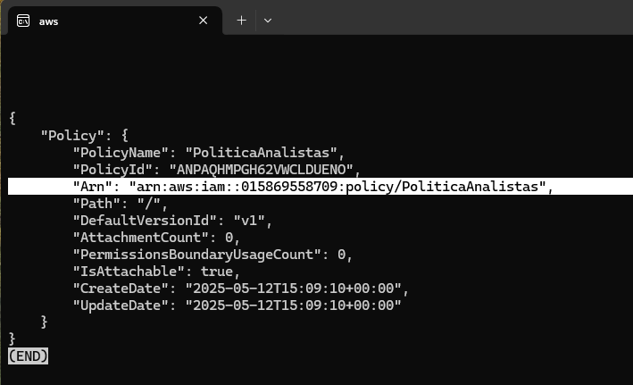, 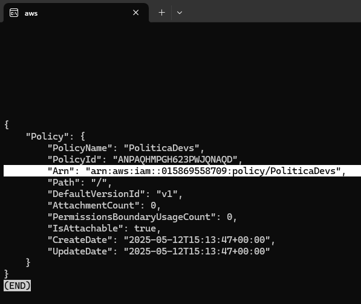

### 7. Asociar políticas a grupos
```bash
aws iam attach-group-policy --group-name grupo-analistas --policy-arn arn:...
aws iam attach-group-policy --group-name grupo-devs --policy-arn arn:...
```
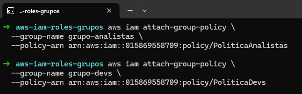, 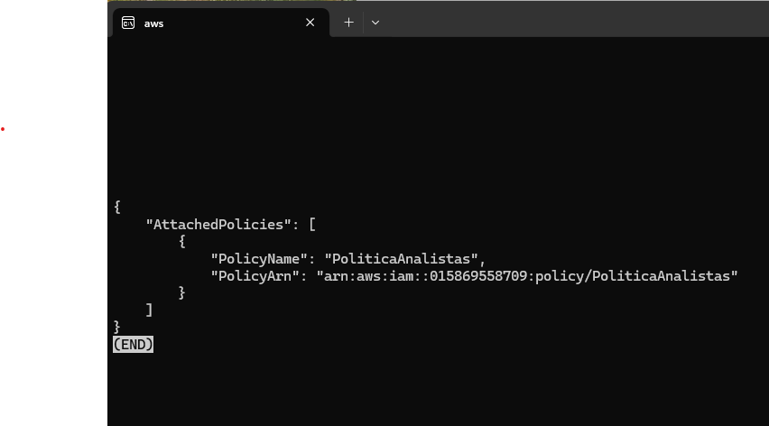, 

### 8. Crear credenciales de acceso
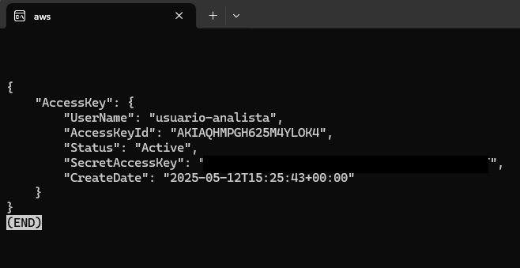, 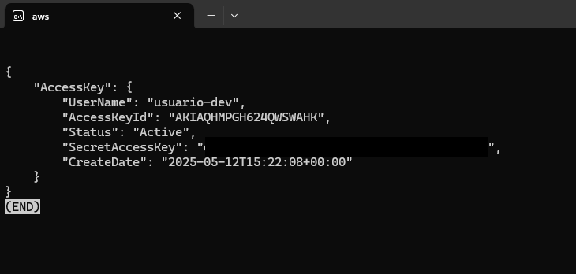

### 9. Configurar perfiles locales
```bash
aws configure --profile analista
aws configure --profile dev
```
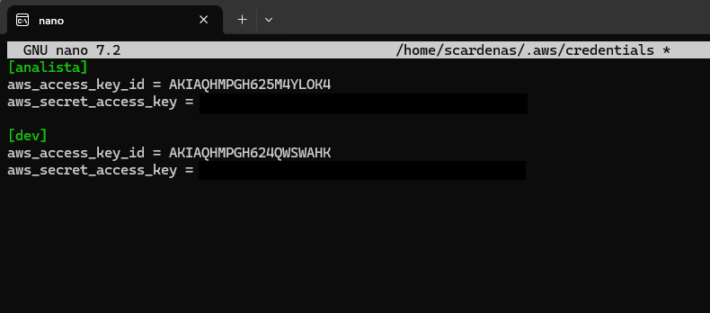

### 10. Asociar usuarios a grupos
```bash
aws iam add-user-to-group --user-name usuario-analista --group-name grupo-analistas
aws iam add-user-to-group --user-name usuario-dev --group-name grupo-devs
```
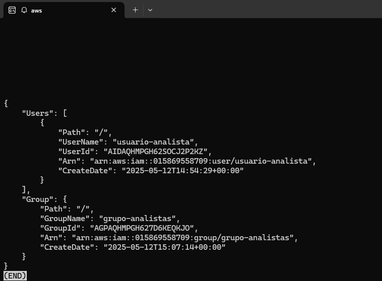, 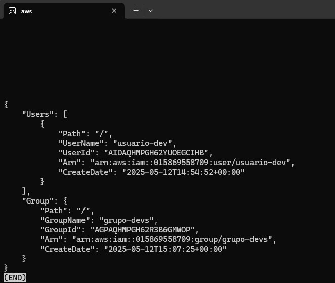

### 11. Probar permisos del usuario analista
```bash
aws s3 ls --profile analista
```
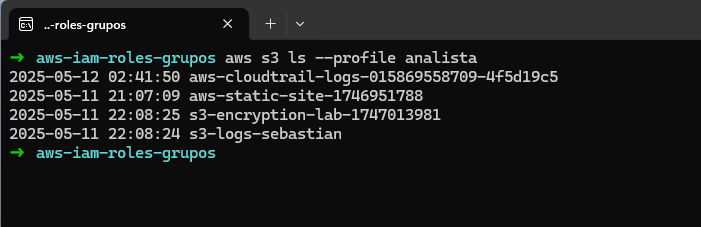

### 12. Probar permisos del usuario dev
```bash
aws ec2 describe-instances --profile dev
aws s3 ls --profile dev  # debe fallar
```
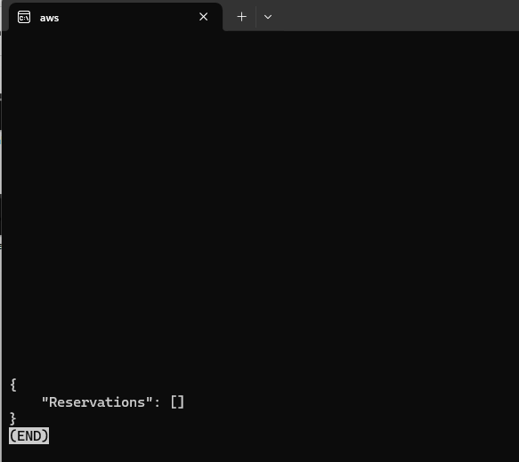, 

---

## ✅ Resultado esperado
- `usuario-analista` puede listar buckets S3 y consultar CloudTrail
- `usuario-dev` puede ver instancias EC2, pero NO acceder a S3
- Cualquier acción fuera de lo definido es denegada

---

## ⚠️ Errores comunes que tuve
- `Unable to locate credentials`: faltaba configurar perfil con `aws configure`
- `AccessDenied`: usuario no estaba asociado al grupo o política no aplicada
- Región no especificada: se corrigió con `--region` o `aws configure`

---

## 🧠 Lección clave
Este laboratorio demuestra la aplicación **real del principio de mínimo privilegio**, utilizando buenas prácticas de IAM como:
- Políticas personalizadas
- Separación de responsabilidades
- Herencia a través de grupos
- Simulación de usuarios con perfiles locales
